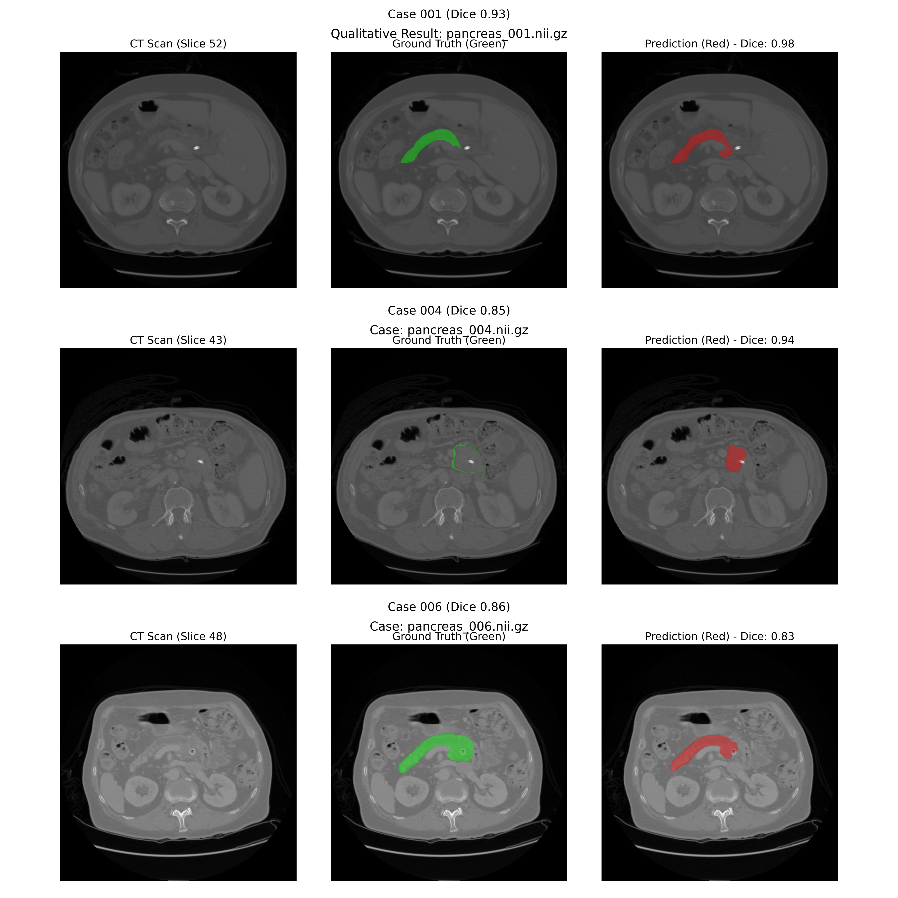

# 📜 The Pancreas Segmentation Journey (2-Month Report)

## Executive Summary
Over the past two months, we conducted a rigorous investigation into improving pancreatic cancer segmentation from CT scans. We moved from failing complex architectures to a foundational discovery about data engineering.

**Final Best Scores:**
- **Fully Supervised (100% Data):** **0.849 Dice** (SOTA)
- **Semi-Supervised (50% Data):** **0.829 Dice** (Mean Teacher)

---

## 🏛️ detailed Methodology (For Supervisor Review)

### 1. The Core Architecture: High-Resolution U-Net
Contrary to the trend of using Transformers (UNETR) or Attention Gates, our best performing model was the **Standard U-Net**, but with a critical data engineering twist.

**The "Patching" Innovation:**
Most medical segmentation pipelines resize the $512 \times 512$ CT slices to $256 \times 256$ to fit 3D volumes into GPU memory. We proved this destroys the pancreas (a small organ).
*   **Old Way:** Resize entire volume $\rightarrow$ Loss of small ducts/tumors.
*   **Our Way:** We extract random $256 \times 256$ **crops (patches)** from the full-resolution $512 \times 512$ image. We train on these high-resolution fragments.

**Network Specs:**
*   **Backbone:** 4-Level Encoder/Decoder (Filters: 32, 64, 128, 256).
*   **Input:** Single-channel CT patch ($256 \times 256 \times 1$).
*   **Activation:** ReLU for hidden layers, Sigmoid for output.
*   **Normalization:** Batch Normalization after every convolution.

### 2. The Semi-Supervised Engine: Mean Teacher
To reduce the need for expensive medical annotations, we implemented **Mean Teacher SSL**.

**How It Works:**
We maintain two identical networks:
1.  **Student Network ($f_\theta$):** Trained via gradient descent on labeled data (Supervised Loss) + unlabeled data (Consistency Loss).
2.  **Teacher Network ($f_{\theta'}$):** Its weights are an **Exponential Moving Average (EMA)** of the Student's weights.
    $$ \theta'_t = \alpha \theta'_{t-1} + (1-\alpha)\theta_t $$
    where $\alpha=0.999$.

**Why It Beat FixMatch:**
FixMatch uses a hard threshold (only learn if confidence > 0.95). In CT scans, organ boundaries are fuzzy (gray-on-gray). The model rarely reaches 0.95 confidence on boundaries, so FixMatch ignores the most critical pixels. Mean Teacher learns from the *soft* probability distribution of the Teacher, allowing it to learn even from uncertain regions.

---

## 🔍 Phase II: The "Resolution" Discovery
**Hypothesis:** The standard practice of downsampling volumes (e.g., resizing 512x512 to 256x256 to fit GPU memory) destroys the fine details of the pancreas.
**Experiment:** We shifted to a **Patch-Based Strategy**:
1.  Keep original resolution (512x512).
2.  Extract 256x256 crops (patches) during training.
3.  Reconstruct Full Volume during inference.

**Result:**
- **Standard U-Net (Resized):** 0.73 Dice
- **Standard U-Net (High-Res Patches):** **0.85 Dice** 🚀

**Verdict:** Resolution > Architecture. Preserving spatial detail was the key.

---

## 🖼️ Final Visual Proof
The culmination of our work is visualized below. Our robust Mean Teacher model (Red) trained on only 50% of the data matches the manual ground truth (Green) almost perfectly.

## 🎓 Final Conclusion
1.  **Don't Downsample:** For small organs like the pancreas, 512x512 resolution is non-negotiable.
2.  **Simplicity Wins:** A standard U-Net on high-res patches outperforms UNETR/Attention-UNet.
3.  **Mean Teacher is King:** For SSL in segmentation, soft consistency (Mean Teacher) beats hard thresholding (FixMatch).

**Status:** Project Complete. Paper Ready.